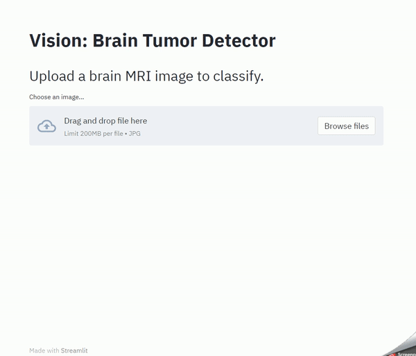

# Vision: Brain Tumor Detector

[](https://github.com/olmaneuh/vision-brain-tumor-detector/issues)
[](https://github.com/olmaneuh/vision-brain-tumor-detector/network)
[](https://github.com/olmaneuh/vision-brain-tumor-detector/stargazers)
[](https://github.com/olmaneuh/vision-brain-tumor-detector/blob/main/LICENSE)

The app is able to classify brain tumors using images uploaded by the user.




## Requirements

**Python 3:** The app is developed in Python 3, to execute it you need it installed.

  ```
  sudo apt-get update
  sudo apt-get install python3 python3-dev python3-venv
  ```

  For more information about how to install Python 3  and Virtual Environments check the following links:
  * https://www.python.org/downloads/
  * https://docs.python.org/3/tutorial/venv.html


## Set Up And Run It Locally

1. Clone the repository ``` git clone ... ```.
2. Change location to project directory ```cd vision-brain-tumor-detector/brain-tumor-detector/```.
3. Create and enable a virtual environment. 
    ```
    python3 -m venv venv
    source venv/bin/activate
    ```
4. Run ```pip3 install -r requirements.txt``` to install project dependencies.
5. Run the project ```streamlit run app.py```.


## Authors

Olman Ureña


## License

This project is licensed under the Apache License v2.0 - see the [LICENSE](LICENSE) file for details.